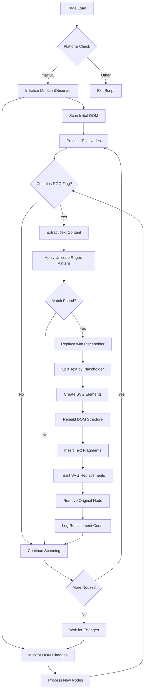

# mac-ROC-flag 🇹🇼

A Tampermonkey userscript that displays the Republic of China flag 🇹🇼 properly on macOS by replacing the Unicode flag emoji with a custom SVG implementation.

## 🌟 Overview

On macOS and Apple devices (especially those manufactured in China), the Republic of China flag Unicode sequence (🇹🇼) is completely blocked and displays nothing due to geopolitical restrictions and censorship policies. This script automatically detects these invisible Unicode sequences and replaces them with a proper Republic of China flag SVG, making the flag visible on web pages.

**Before:** 🇹🇼 → (invisible/no display)  
**After:** 🇹🇼 →  (proper flag display)

## 🚀 Features

- **Automatic Detection**: Scans all text content on web pages for Republic of China flag Unicode sequences
- **Real-time Replacement**: Works with dynamically loaded content via MutationObserver
- **Cross-platform**: Specifically designed for macOS systems
- **Lightweight**: Minimal performance impact with efficient DOM traversal
- **Universal**: Works on all websites (`*://*/*`)

## 📋 Technical Implementation

### Core Components

#### 1. Unicode Flag Detection
The script uses Unicode code point matching to detect Republic of China flag sequences:

```javascript
let flag = /\u{1F1F9}\u{1F1FC}/gu;
```

- `\u{1F1F9}`: Regional Indicator Symbol T (🇹) - Unicode U+1F1F9
- `\u{1F1FC}`: Regional Indicator Symbol W (🇼) - Unicode U+1F1FC
- `gu` flags: Global matching with Unicode support for proper code point recognition

This approach directly matches Unicode code points rather than UTF-16 surrogate pairs, ensuring reliable detection across different JavaScript environments.

#### 2. SVG Replacement System
Instead of relying on external resources, the script embeds a complete Republic of China flag SVG:

- **Embedded SVG**: Self-contained flag design matching official specifications
- **Responsive Sizing**: Automatically scales to match surrounding text (1em × 1em)
- **Proper Styling**: CSS styling ensures consistent appearance across different contexts

#### 3. DOM Manipulation Strategy
The replacement process uses a placeholder-based approach for robust text processing:

```javascript
// Replace all flag occurrences with placeholder
const textWithPlaceholder = textContent.replace(flag, flagPlaceholder);

// Split by placeholder and rebuild with SVG
const parts = textWithPlaceholder.split(flagPlaceholder);
```

This method ensures:
- **Complete Replacement**: All instances in a text node are processed
- **Text Preservation**: Non-flag content remains unchanged
- **Multiple Flags**: Handles multiple flag Unicode sequences in the same text block

#### 4. Dynamic Content Monitoring
Uses MutationObserver to handle dynamically loaded content:

```javascript
let observer = new MutationObserver(mutationHandler);
observer.observe(_.body, {childList: true, subtree: true});
```

## 🔄 Workflow Process



## 🛠 Installation

### Prerequisites
- macOS system
- Tampermonkey browser extension installed

### Steps
1. Install [Tampermonkey](https://www.tampermonkey.net/) in your browser
2. Click [Install Script](https://raw.githubusercontent.com/tizee-tampermonkey-scripts/tampermonkey-mac-ROC-flag/refs/heads/main/mac-ROC-flag.js)
3. Confirm installation in Tampermonkey dashboard
4. The script will automatically activate on all websites

## 🔧 Configuration

### Script Metadata
- **Version**: 1.1
- **Match**: All URLs (`*://*/*`)
- **Grant**: `GM_addStyle` for CSS injection
- **Auto-update**: Enabled via GitHub raw URLs

### Customization Options
The SVG styling can be modified by editing the CSS properties:

```javascript
svg.style.height = '1em';           // Size relative to text
svg.style.width = '1em';
svg.style.margin = '0 .05em 0 .1em'; // Spacing around flag
svg.style.verticalAlign = '-0.1em';   // Baseline alignment
```

## ⚡ Performance Considerations

### Optimization Features
- **Platform Detection**: Only activates on macOS systems
- **Mobile Exclusion**: Skips mobile devices to avoid unnecessary processing
- **Efficient Scanning**: Uses TreeWalker for optimal DOM traversal
- **Smart Filtering**: Excludes form elements and content-editable areas
- **Unicode Pattern Matching**: Direct code point matching reduces false positives

### Memory Management
- **Node Cleanup**: Properly removes and replaces DOM nodes
- **Observer Management**: Single MutationObserver instance for the entire page
- **Garbage Collection**: No circular references or memory leaks

## 🔍 Debugging

Enable debug logging by opening browser developer tools. The script logs replacement activity:

```javascript
console.debug('Replace ROC flag:', parts.length - 1, 'occurrences replaced');
```

## 📚 Technical Details

### Unicode Background
- Republic of China flag: U+1F1F9 U+1F1FC (Regional Indicator T + W)
- Apple system limitation: These Unicode sequences are completely blocked and display nothing due to geopolitical restrictions and censorship policies
- Solution: Direct Unicode code point pattern matching with `\u{...}` syntax to detect invisible sequences

### SVG Implementation
- **Vector Format**: Scalable without quality loss
- **Color Accuracy**: Matches official Republic of China flag colors (#FE0000 red, #000095 blue, white)
- **Embedded Design**: No external dependencies
- **CSS Integration**: Styled to match text flow and baseline alignment

## 🤝 Contributing

1. Fork the repository
2. Create a feature branch
3. Make your changes
4. Test on macOS
5. Submit a pull request

## 📄 License

This project is open source. See [LICENSE](LICENSE) file for details.

## 🙏 Acknowledgments

- Republic of China flag SVG design from [Twitter's Twemoji](https://github.com/twitter/twemoji) library
- SVG optimization for web performance
- Inspired by the need to overcome censorship restrictions and restore proper flag representation on Apple devices
